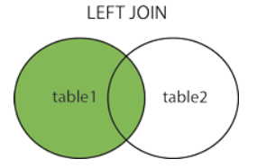

## SQL 语法

### 一、概念

SQL（Structured Query Language)，标准 SQL 由 ANSI 标准委员会管理，从而称为 ANSI SQL。各个 DBMS 都有自己的实现，如 PL/SQL、Transact-SQL 等。

SQL 语句不区分大小写，但是数据库表名、列名和值是否区分依赖于具体的 DBMS 以及配置。

**SQL 支持以下三种注释：**

```sql
## 注释
SELECT *
FROM mytable; -- 注释
/* 注释1
   注释2 */

```

**数据库的创建与使用**

```sql
CREATE DATABASE test;
USE test;
```

### 二、创建表

```sql
CREATE TABLE `yuedu_members` (
  `u_id` int(11) NOT NULL AUTO_INCREMENT COMMENT '用户id',
  `u_openid` varchar(100) NOT NULL COMMENT 'openid',
  `u_name` varchar(50) NOT NULL COMMENT '用户昵称',
  `u_face` varchar(200) NOT NULL COMMENT '用户头像',
  `u_random` varchar(30) NOT NULL COMMENT '用户随机码',
  `u_integral` int(10) DEFAULT '0' COMMENT '积分',
  `u_remainder` int(10) DEFAULT '0' COMMENT '余额',
  `u_regtime` int(11) NOT NULL COMMENT '用户注册时间',
  PRIMARY KEY (`u_id`),
  UNIQUE KEY `u_openid` (`u_openid`),
  UNIQUE KEY `u_id` (`u_id`)
) ENGINE=InnoDB AUTO_INCREMENT=1 DEFAULT CHARSET=utf8mb4;
```

### 三、修改表

添加列

```sql
ALTER TABLE mytable
ADD col CHAR(20)
```

删除列

```sql
ALTER TABLE mytable
DROP COLUMN col;
```

删除表

```sql
DROP TABLE myable;
```

### 四、插入

普通插入

```sql
INSERT INTO mytable(col1, col2)
```

插入检索出来的数据

```sql
INSERT INTO mytable1(col1, col2)
SELECT col1, col2
FROM mytable2;
```

将一个表的内容插入到一个新表

```sql
CREATE TABLE newtable AS
SELECT * FROM mytable;
```

### 五、更新

```sql
UPDATE mytable
SET col = val
WHERE id = 1;
```

### 六、删除

```sql
DELETE FROM mytable
WHERE id = 1;
```

TRUNCATE TABLE 也可以清空表，也就是删除所有行。

```sql
TRUNCATE TABLE mytable;
```

使用更新和删除操作时一定要用 WHERE 子句，不然会把整张表的数据都破坏。可以先用 SELECT 语句进行测试，防止错误删除。

### 七、查询

#### DISTINCT

相同值只会出现一次。它作用于所有列，也就是说所有列的值都相同才算相同。

```sql
SELECT DISTINCT col1, col2
FROM mytable;
```

#### LIMIT

限制返回的行数。可以有两个参数，第一个参数为起始行，从0开始；第二个参数为返回的总函数。

返回前5行：

```sql
SELECT *
FROM mytable
LIMIT 5;
```

```sql
SELECT *
FROM mytable
LIMIT 0, 5;
```

返回第3~5行：

```sql
SELECT *
FROM mytable
LIMIT 2, 3;
```

### 八、排序

* ASC：升序(默认)
* DESC：降序

可以按多个列进行排序，并且为每个列指定不同的排序方式：

```sql
SELECT *
FROM mytable
ORDER BY col1 DESC,	col2 ASC;
```

### 九、过滤

不进行过滤的数据非常大，导致通过网络传输了多余的数据，从而浪费了网络带宽。因此尽量使用SQL语句来过滤不必要的数据，而不是传输所有的数据到客户端然后由客户端进行过滤。

```sql
SELECT *
FROM mytable
WHERE col IS NULL;
```

下表显示了 WHERE 子句可用的操作符

| 操作符  |     说明     |
| :-----: | :----------: |
|    =    |     等于     |
|    <    |     小于     |
|    >    |     大于     |
|  <> !=  |    不等于    |
|  <= !>  |   小于等于   |
|  >= !<  |   大于等于   |
| BETWEEN | 在两个值之间 |
| IS NULL |  为 NULL 值  |

应该注意到，NULL与0、空字符串都不同。

AND 和 OR用于连接多个过滤条件。优先处理AND，当一个过滤表达式涉及到多个AND 和 OR时，可以使用 () 来决定优先级，使得优先级关系更加清晰。

IN 操作符用于匹配一组值，气候也可以接一个SELECT子句，从而匹配子查询得到的一组值。

NOT 操作符用于否定一个条件。

### 十、通配符

通配符也是用在过滤语句中，但它只能用于文本字段。

* %匹配 >=0 个任意字符；
* _匹配 == 1个任意字符；
* []可以匹配集合内的字符，例如[ab]将匹配字符a或者b。用脱字符^可以对其进行否定，也就是不匹配集合内的字符。

使用Like来进行通配符匹配。

```sql
SELECT *
FROM mytable
WHERE col like '[^AB]%';--不以A和B开头的任意文本
```

不要滥用通配符，通配符位于开头处匹配会非常慢。

### 十一、计算字段

在数据库服务器上完成数据的转换和格式化的工作往往比客户端上快得多，并且转换和格式化后的数据量更少的话可以减少网络通信量。


计算字段通常要使用AS来取别名，否则输出的时候字段名为计算表达式。

```sql
SELECT col1 * col2 AS alias
FROM mytable;
```

CONCAT()用于连接两个字段。许多数据库会使用空格把一个值填空为列宽，因此连接的结果会出现一些不必要的空格，使用TRIM()可以去除首尾空格。

```sql
SELECT CONCAT(TRIM(col1), '(', TRIM(col2), ')') AS concat_col
FROM mytable;
```

### 十二、函数

各个DBMS的函数都是不相同的，因此不可移植，以下主要是MySql的函数。

#### 汇总

|  函 数  |      说 明       |
| :-----: | :--------------: |
|  AVG()  | 返回某列的平均值 |
| COUNT() |  返回某列的行数  |
|  MAX()  | 返回某列的最大值 |
|  MIN()  | 返回某列的最小值 |
|  SUM()  |  返回某列值之和  |

AVG() 会忽略NULL行。

使用 DISTINCT 可以汇总不同的值。

```sql
SELECT AVG(DISTINCT col1) AS avg_col
FROM mytable;
```

#### 文本处理

|   函数    |      说明      |
| :-------: | :------------: |
|  LEFT()   |   左边的字符   |
|  RIGHT()  |   右边的字符   |
|  LOWER()  | 转换为小写字符 |
|  UPPER()  | 转换为大写字符 |
|  LTRIM()  | 去除左边的空格 |
|  RTRIM()  | 去除右边的空格 |
| LENGTH()  |      长度      |
| SOUNDEX() |  转换为语音值  |

其中，SOUNDEX()可以讲一个字符串转换为描述其语音表示的字母数字模式。

```sql
SELECT *
FROM mytable
WHERE SOUNDEX(col1) = SOUNDEX('apple')
```

#### 日期和时间处理

- 日期格式：YYYY-MM-DD
- 时间格式：HH:<zero-width space>MM:SS

|     函 数     |             说 明              |
| :-----------: | :----------------------------: |
|   ADDDATE()   |    增加一个日期（天、周等）    |
|   ADDTIME()   |    增加一个时间（时、分等）    |
|   CURDATE()   |          返回当前日期          |
|   CURTIME()   |          返回当前时间          |
|    DATE()     |     返回日期时间的日期部分     |
|  DATEDIFF()   |        计算两个日期之差        |
|  DATE_ADD()   |     高度灵活的日期运算函数     |
| DATE_FORMAT() |  返回一个格式化的日期或时间串  |
|     DAY()     |     返回一个日期的天数部分     |
|  DAYOFWEEK()  | 对于一个日期，返回对应的星期几 |
|    HOUR()     |     返回一个时间的小时部分     |
|   MINUTE()    |     返回一个时间的分钟部分     |
|    MONTH()    |     返回一个日期的月份部分     |
|     NOW()     |       返回当前日期和时间       |
|   SECOND()    |      返回一个时间的秒部分      |
|    TIME()     |   返回一个日期时间的时间部分   |
|    YEAR()     |     返回一个日期的年份部分     |

 

```sql
mysql> SELECT NOW();
```

```sql
+---------------------+
| now()               |
+---------------------+
| 2021-02-16 15:54:34 |
+---------------------+
1 row in set (0.00 sec)
```

#### 数值处理

|  函数  |  说明  |
| :----: | :----: |
| SIN()  |  正弦  |
| COS()  |  余弦  |
| TAN()  |  正切  |
| ABS()  | 绝对值 |
| SQRT() | 平方根 |
| MOD()  |  余数  |
| EXP()  |  指数  |
|  PI()  | 圆周率 |
| RAND() | 随机数 |

### 十三、分组

把具有相同的数据值的行放在同一组。

可以对同一分组数据使用汇总函数进行处理，例如求分组数据的平均值等。

指定的分组字段除了能按该字段进行分组，也会自定按该字段进行排序。

```sql
SELECT col, count(*) AS num
FROM mytable
GROUP BY col
```

GROUP BY 自动按分组字段进行排序，ORDER BY 也可以按汇总字段来进行排序。

```sql
SELECT col, COUNT(*) AS num
FROM mytable
GROUP BY col
ORDER BY num;
```

WHERE 过滤行，HAVING 过滤分组，行过滤应当优先于分组过滤。

```sql
SELECT col, count(*) AS num
FROM mytable
WHERE col > 2
GROUP BY col
HAVING num >= 2;
```

分组规定：

* GROUP BY 字句出现 WHERE 子句之后， ORDER BY 子句之前；
* 除了汇总字段外，SELECT 语句中的每一字段都必须在GROUP BY 子句中给出；
* NULL的行会单独分为一组；
* 大多数SQL实现不支持GROUP BY 列具有可变长度的数据类型。

### 十四、子查询

子查询中只能返回一个字段的数据。

可以将子查询的结果作为WHERE 语句的过滤条件：

```sql
SELECT *
FROM mytable1
WHERE col1 IN(SELECT col2 
              FROM mytable2);
```

下面的语句可以检索出客户的订单数量，子查询语句会对第一个查询检索出的每个客户执行一次：

```sql
SELECT cust_name, (SELECT COUNT(*)
                  FROM Orders
                  WHERE Orders.cust_id = Customers.cust_id)
                  AS orders_num
FROM Customers
ORDER BY cust_name;
```

### 十五、连接

连接用于连接多个表，使用 JOIN 关键字，并且条件语句使用 ON 而不是 WHERE。

连接可以替换子查询，并且比子查询的效率一般会更快。

可以用 AS 给列名、计算字段和表名取名，给表名取名是为了简化SQL语句以及连接相同表。

#### 内连接

内连接又称等值连接，使用 INNER JOIN 关键字。

```sql
SELECT A.value, B.value
FROM tablea AS A INNER JOIN tableb AS B
```

可以不明确使用 INNER JOIN，而使用普通查询并在 WHERE 中将两个表中要连接的列用等值方法连接起来。

```sql
SELECT A.VALUE, B.value
FROM tablea AS A, tableb AS B
WHERE A.key = B.key
```

#### 自连接

自连接可以看成内连接的一种，只是连接的表是自身而已。

一张员工表，包含员工姓名和员工所属部门，要找出与 Jim 处在同一部门的所有员工姓名。

子查询版本

```sql
SELECT name
FROM employee
WHERE department = (
      SELECT department
      FROM employee
      WHERE name = "Jim");
```

自连接版本

```sql
SELECT e1.name
FROM employee AS e1 INNER JOIN employee AS e2
ON e1.department = e2.department
AND e2.name = "Jim";
```

#### 自然连接

自然连接是把同名列通过等值测试连接起来的，同名列可以有多个。

内连接和自然连接的区别：内连接提供连接的列，而自然连接自动连接所有同名列。

```sql
SELECT A.value, B.value
FROM tablea AS A NATURAL JOIN tableb AS B;
```

#### 外连接

外连接保留了没有关联的那些行。分为做左外连接，右外连接以及全外连接，左外连接就是保留左表没有关联的行。

检索所有顾客的订单信息，包括还没有订单信息的顾客

```sql
SELECT Customers.cust_id, Customers.cust_name, Orders.order_id
FROM Customers LEFT JOIN Orders
ON Customers.cust_id = Orders.cust_id;
```

customers 表：

| cust_id | cust_name |
| :-----: | :-------: |
|    1    |     a     |
|    2    |     b     |
|    3    |     c     |

orders 表：

| order_id | cust_id |
| :------: | :-----: |
|    1     |    1    |
|    2     |    1    |
|    3     |    3    |
|    4     |    3    |

结果：

| cust_id | cust_name | order_id |
| :-----: | :-------: | :------: |
|    1    |     a     |    1     |
|    1    |     a     |    2     |
|    3    |     c     |    3     |
|    3    |     c     |    4     |
|    2    |     b     |   Null   |

* tips

  - **INNER JOIN**：如果表中有至少一个匹配，则返回行 （INNER JOIN 与 JOIN 是相同的）
  - **LEFT JOIN**：即使右表中没有匹配，也从左表返回所有的行。如果右表中没有匹配，则结果为 NULL。
  - **RIGHT JOIN**：即使左表中没有匹配，也从右表返回所有的行。如果左表中没有匹配，则结果为 NULL。
  - **FULL JOIN**：只要其中一个表中存在匹配，则返回行

  

  

  

  

  

### 十六、组合查询

使用 UNION 来组合两个查询，如果第一个查询返回M行，第二个查询返回N行，name组合查询的结果一般为M + N行。

每个查询必须包含相同的列、表达式和聚集函数。

默认会去除相同行，如果需要保留相同行，使用UNION ALL。

只能包含一个ORDER BY子句，并且必须位于语句的最后。

```sql
SELECT col
FROM mytable
WHERE col = 1
UNION
SELECT col
FROM mytable
WHERE col = 2;
```

### 十七、视图

视图是虚拟的表，本身不包含数据，也就不能对其进行索引操作。
对视图的操作和对普通表的操作一样。

视图具有如下好处：

	* 简化复杂的SQL操作，比如复杂的连接；
	* 只使用实际表的一分部数据；
	* 通过只给用户访问视图的权限，保证数据的安全性；
	* 更改数据格式和表示。

```sql
CREATE VIEW myview AS
SELECT Concat(col1, col2) AS concat_col, col3*col4 AS compute_col
FROM mytable
WHERE col5 = val;
```

### 十八、存储过程

存储过程可以看成是对一系列SQL操作的批处理。

使用存储过程的好处：

* 代码封装，保证了一定的安全性；
* 代码复用；
* 由于是预先编译，因此具有很高的性能。

命令行中创建存储过程需要定义分隔符，因此命令行是以；为结束符，而存储过程中也包含了分号，因此会错误把这部分分号当成是结束符，从而造成语法错误。

包含 in、out 和 inout 三种参数。

给变量赋值都需要 select into 语句。

每次只能给一个变量赋值，不支持集合的操作。

```sql
delimiter //

create oricedure myprocedure (out ret int)
	begin
		declare y int;
		select sum(col1)
		from mytable
		into y;
		select y*y into ret;
	end //
delimiter;
```

```sql
call myprocedure(@ret);
select @ret;
```

### 十九、游标

在存储过程中使用游标可以对一个结果集进行移动遍历。

游标主要用于交互应用，其中用户需要对数据集中的任意进行浏览和修改。

使用游标的四个步骤：

* 声明游标，这个过程没有实际检索出数据；
* 打开游标；
* 取出数据；
* 关闭游标；

```sql
delimier //
create procedure myprocedure(out ret int)
	begin	
		declare done boolean defalut 0;
		
		declare mycursor cursor for
		select col1 from mytable;
		#定义了一个 continue handler，当sqlstate '02000' 这个条件出现时，会执行 set done = 1
		declare continue handler for sqlstate '02000' set done = 1;
		
		open mycursor;
		
		repeat
			fetch mycusor into ret;
			select ret;
			
		until done end repeat;
		
		colse mycursor;
	end //
delimier;	
```

### 二十、触发器

触发器会在某个表执行以下语句是而自动执行：DELETE、INSERT、UPDATE。

触发器必须指定在语句执行之前还是之后自动执行，之前执行使用 BEFORE 关键字，之后执行使用 AFTER 关键字。BEFORE 用于数据验证和净化，AFTER 用于审计跟踪，将修改记录到另外一张表中。

INSERT 触发器包含一个名为 NEW 的虚拟表。

```sql
CREATE TRIGGER myrigger AFTER INSERT ON mytable
FOR EACH ROW SELECT NEW.col into @result;

SELECT @result; --获取结果
```

DELETE 触发器包含一个名为OLD的虚拟表，并且是只读的。

UPDATE 触发器包含一个名为NEW的一个名为OLD的虚拟表，其中NEW是可以被修改的，而OLD是只读的。

MySQL不允许在触发器中使用CALL语句，也就是不能调用存储过程。

### 二十一、事务管理

基本术语：

* 事务(transaction) 指一组SQL语句；
* 回退(rollback) 指撤销指定SQL语句的过程；
* 提交(commit) 指将未存储的SQL语句结果写入数据库表；
* 保留点(savepoint) 指事务处理中设置的临时占位符(placeholder)，你可以对它发布回退(与回退整个事务处理不同)。

不能回退SELECT 语句，回退SELECT语句也没有意义；也不能回退CREATE和DROP语句。

MySql的事务提交默认是隐式提交，每执行一条语句就把这条语句当成一个事务然后进行提交。当出现START TRANSACTION语句时，会关闭隐式提交；当COMMIT或ROLLBACK语句执行后，事务会自动关闭，重新恢复隐式提交。

设置autocommit为0可以取消自动提交；autocommit标记是针对每个连接而不是针对服务器的。

如果没有设置保留点，ROLLBACK会回退到START TRANSACTION语句处，如果设置了保留点，并且在ROLLBACK中指定该保留点，则会回退该保留点。

```sql
STRAT TRANSACTION
// ...
SVAEPOIN delete1
// ...
ROLLBACK TO delete1
// ...
COMMIT
```

### 二十二、字符集

基本术语：

* 字符集为字母和符号的集合；

* 编码为某个字符集成员的内部表示；

* 校对字符指定如何比较，主要用于排序和分组。

  

除了给表指定字符集和校对外，也可以给列指定：

```sql
CREATE TABLE mytable
(col VARCHAR(20)) CHARCTER SET latin COLLATE latin1_general_ci)
DEFALUT CHARCTER SET hebrew COLLATE hebrew_general_ci;
```

可以在排序、分组时指定校对：

```sql
SELECT *
FROM mytable
ORDER BY col COLLATE latin1_general_ci;
```

### 二十三、权限管理

MySQL的账户信息保存在mysql这个数据库中

```sql
USER mysql;
SELECT user FROM user;
```

#### 创建用户

新创建的用户没有任何权限。

```sql
CREATE USER myuser IDENTIFIED BY 'mypassword';
```

#### 修改账户名

```
RENAME USER myuser TO newuser;
```

#### 删除账户

```sql
DROP USER myuser;
```

#### 查看权限

```sql
SHOW GRANTS FOR myuser;
```

#### 授予权限

账户用username@host的形式定义，username@%使用的是默认主机名。

```sql
GRANT SELECT, INSERT ON mydatebase.* TO myuser;
```

#### 删除权限

GRANT 和 REVOKE 可在几个层次上控制访问权限：

* 整个服务器，使用 GRANT ALL 和 REVOKE ALL；
* 整个数据库，使用 ON database.*;
* 特定的表，使用  ON database.table;
* 特定列；
* 特定的存储过程。

```sql
REVOKE SELECT, INSERT ON mydatabase.* FROM myuser;
```

#### 更改密码

必须使用 Password() 函数进行加密

```sql
SET PASSWORD FOR myuser = Password('new_password');
```

### 参考资料

* [cyc2018](http://www.cyc2018.xyz)

* BenForta. SQL 必知必会 [M]. 人民邮电出版社, 2013.